# ALTHAF HUSSAIN SYED

  <picture>
    <source media="(prefers-color-scheme: dark)" srcset="assets/dark.svg">
    <source media="(prefers-color-scheme: light)" srcset="assets/light.svg">
    
  </picture>

 

  <a href="https://althafportfolio.site">🌐 Portfolio</a> •
  <a href="mailto:althafhussain.sd@gmail.com">✉️ Email</a> •
  <a href="https://linkedin.com/in/althafhussainsyed">👔 LinkedIn</a> •
  <a href="https://github.com/ALTHAFHUSSAINSYED">💻 GitHub</a>

---

## ⚡ Professional Summary

Results-driven DevOps and Cloud Platform Engineer with **3.10 years of experience at DXC Technology**. Specializing in AWS infrastructure automation, Kubernetes platform engineering, and enterprise-grade CI/CD delivery. Recipient of **two DXC CHAMPS Awards** for consistent delivery excellence and operational accountability.

- ☸️ **Kubernetes**: Managed production EKS clusters, configured HPA and Cluster Autoscaler, maintaining **99.9% uptime** over a 2-year production run with zero downtime.
- 🏗️ **Infrastructure as Code (IaC)**: Reduced environment spin-up times by **~60%** and cut IaC duplication by **~50%** across multiple projects using reusable Terraform modules.
- 🚀 **CI/CD Pipelines**: Automated container builds, Trivy scans, SonarQube quality gates, and deployments, cutting manual deployment efforts by **70%**.
- 📊 **Observability & SRE**: Reduced Mean Time to Detect (MTTD) anomalies by **~40%** through real-time Prometheus, Grafana, and CloudWatch dashboard integrations.

---

## 🏆 Certifications

  <table>
    <tr>
      <td>
        
      </td>
      <td>
        
      </td>
    </tr>
    <tr>
      <td>
        
      </td>
      <td>
        
      </td>
    </tr>
    <tr>
      <td>
        
      </td>
      <td>
        
      </td>
    </tr>
  </table>
  
   
  
  Also Certified in: **Microsoft Azure Fundamentals (AZ-900)**

---

## 🛠️ Tech Stack & Skills

### ☁️ Cloud & Infrastructure

### ☸️ Containers & Orchestration

### 🏗️ Infrastructure as Code (IaC) & Automation

### 🚀 CI/CD & Artifacts

### 📊 Observability & Monitoring

### 🔒 Security, Quality & Operations

---

## 🏗️ Highlighted Projects

### 🚀 [AI-Powered Portfolio & Content Automation Platform](https://althafportfolio.site/)
**Solo Project | Oct 2025 – Present**
> Fully automated personal platform showcasing portfolio projects, blogs, and real-time AWS infrastructure integration.
- 🏗️ **Infrastructure**: Provisioned AWS resources (VPC, public/private subnets, Security Groups, EC2, S3) from scratch using **Terraform IaC** with zero manual console intervention.
- 📦 **Containerization**: Wrapped all web services and microservices into light, production-ready **Docker containers**.
- 🤖 **CI/CD**: Developed environment-specific **GitHub Actions workflows** integrating automated Trivy vulnerability scanning, multi-stage Docker builds, image pushes, Nginx reverse proxy configuration, and SSL registration via Let's Encrypt.
- 🔄 **Reliability**: Configured self-healing Docker structures and automated rollback triggers for zero-downtime deployments.

---

### ☸️ Cloud-Native Kubernetes Platform on Amazon EKS
**DXC Technology | Mar 2024 – Apr 2026**
> Production-grade container orchestration system hosting microservices for enterprise-level clients.
- ☸️ **EKS Clustering**: Provisioned multi-region AWS EKS clusters using reusable **Terraform modules**, reducing cluster spin-up time by **~60%** and IaC duplication by **~50%**.
- 📈 **Autoscaling**: Designed and tested Horizontal Pod Autoscaler (HPA) and Cluster Autoscaler configs, ensuring service stability during high traffic loads and achieving **99.9% uptime**.
- 📊 **Monitoring Stack**: Integrated Prometheus agent nodes and configured custom Grafana dashboard topologies, reducing incident response lags and Mean Time to Detect (MTTD) by **40%**.

---

### 🔗 Enterprise CI/CD Automation & Security Pipeline
**DXC Technology | Jul 2023 – Feb 2024**
> Standardized security-first delivery pipeline handling deployments for a 6+ member engineering team.
- ⚙️ **Pipelines**: Maintained Jenkins and GitHub Actions pipelines that run automated Maven builds, SonarQube static code quality analysis, and Docker builds on pull requests.
- 🛡️ **Shift-Left Security**: Integrated Trivy container image security scans and SonarQube quality gates, blocking non-compliant builds before they hit AWS ECR. Improved base quality score by **~25%**.
- 🔵🟢 **Deployment Strategies**: Configured AWS Developer Tools (CodeDeploy, CodePipeline) to perform **Blue-Green and Rolling deployments**, eliminating downtime and reducing failed release rollbacks by **~50%**.

---

## 📈 GitHub Stats

  <table border="0">
    <tr>
      <td>
        
      </td>
      <td>
        
      </td>
    </tr>
  </table>

---

## 🐍 Contribution Snake

  <picture>
    <source media="(prefers-color-scheme: dark)" srcset="https://raw.githubusercontent.com/ALTHAFHUSSAINSYED/ALTHAFHUSSAINSYED/output/github-contribution-grid-snake-dark.svg">
    <source media="(prefers-color-scheme: light)" srcset="https://raw.githubusercontent.com/ALTHAFHUSSAINSYED/ALTHAFHUSSAINSYED/output/github-contribution-grid-snake.svg">
    
  </picture>

---

  Designed with ❤️ by Althaf Hussain Syed. © 2026. All Rights Reserved.

